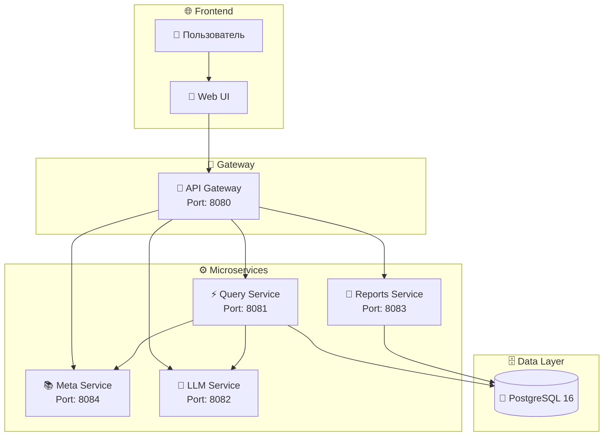

<div align="center">


<br>

<p align="center">
  
  
  
  
</p>

<p align="center">
  
  
  
</p>

<br>

**🚀 Превращайте русский текст в аналитику за секунды**

*Безопасный NL→SQL pipeline с explainability, guardrails и визуализацией*

[🌟 Демо](#-демо) • [🚀 Быстрый старт](#-быстрый-старт) • [📖 Документация](#-архитектура) • [🛡️ Безопасность](#️-безопасность)

</div>

---

<br>

## ✨ Что это?

<div align="center">

```
┌─────────────────────────────────────────────────────────────────┐
│  "Покажи выручку по городам за последние 30 дней"              │
│                        ⬇️                                        │
│              🧠 LLM (GigaChat/YandexGPT)                        │
│                        ⬇️                                        │
│              📊 Intent JSON (структура)                         │
│                        ⬇️                                        │
│              🔒 SQL Builder (Go)                                │
│                        ⬇️                                        │
│              📈 Результат + График                              │
└─────────────────────────────────────────────────────────────────┘
```

</div>

<br>

**Drivee Analytics** — это микросервисная платформа self-service аналитики, которая позволяет бизнес-пользователям:

| 💬 | Задавать вопросы на русском языке |
|----|-----------------------------------|
| 🔒 | Получать безопасные SQL-запросы |
| 📊 | Видеть результаты в таблицах и графиках |
| 💾 | Сохранять отчёты для повторного использования |
| 🧠 | Понимать логику через explainability |

<br>

---

<br>

## 🎥 Демо

<div align="center">

### 🖼️ Интерфейс платформы

<p align="center">
  <kbd>
    
  </kbd>
</p>

*💡 Замените на реальный скриншот: `web/screenshot.png`*

</div>

<br>

### 🎯 Примеры запросов

<table>
<tr>
<td width="50%">

**💬 Ввод пользователя:**
```text
Покажи выручку по городам 
за последние 30 дней
```

</td>
<td width="50%">

**🧠 Интерпретация:**
```json
{
  "metric": "revenue",
  "group_by": "city",
  "period": "last_30_days",
  "confidence": 0.95
}
```

</td>
</tr>
<tr>
<td colspan="2" align="center">

**📊 Результат:**

| Город | Выручка | График |
|-------|---------|--------|
| Москва | ₽2.4M | 📈 |
| СПб | ₽1.8M | 📈 |
| Казань | ₽890K | 📈 |

</td>
</tr>
</table>

<br>

---

<br>

## 🏗️ Архитектура

<div align="center">



</div>

<br>

### 📋 Микросервисы

<table>
<tr>
<td width="20%" align="center">

### 🚪 Gateway
`8080`

</td>
<td>

Единая точка входа. Раздаёт статический frontend и проксирует API-запросы к внутренним сервисам.

</td>
</tr>
<tr>
<td align="center">

### 📚 Meta
`8084`

</td>
<td>

Semantic layer: метрики, измерения, бизнес-термины, шаблоны вопросов.

</td>
</tr>
<tr>
<td align="center">

### 🧠 LLM
`8082`

</td>
<td>

Интерпретация русского текста в структурированный intent JSON. Поддержка GigaChat, YandexGPT и rule-based fallback.

</td>
</tr>
<tr>
<td align="center">

### ⚡ Query
`8081`

</td>
<td>

Валидация intent, построение SQL, выполнение запросов, explainability, генерация графиков.

</td>
</tr>
<tr>
<td align="center">

### 💾 Reports
`8083`

</td>
<td>

Сохранение отчётов, история запусков, повторное выполнение.

</td>
</tr>
</table>

<br>

---

<br>

## 🚀 Быстрый старт

<div align="center">

### ⚡ Запуск за 5 минут

</div>

<br>

<details open>
<summary><b>🐳 Способ 1: С Docker (рекомендуется)</b></summary>
<br>

```bash
# 1. Клонируйте репозиторий
git clone https://github.com/ykysbomja5/hakaton-final.git
cd hakaton-final

# 2. Запустите PostgreSQL
docker-compose up -d

# 3. Дождитесь инициализации (10 сек)
sleep 10

# 4. Запустите все сервисы
powershell -ExecutionPolicy Bypass -File .\scripts\run-local.ps1

# 5. Откройте http://localhost:8080 🎉
```

</details>

<br>

<details>
<summary><b>💻 Способ 2: Без Docker</b></summary>
<br>

```bash
# 1. Создайте БД
createdb drivee_analytics

# 2. Примените схему
psql -d drivee_analytics -f db/schema.sql

# 3. Загрузите данные
psql -d drivee_analytics -f db/seed.sql

# 4. Настройте окружение
copy .env.example .env

# 5. Запустите
powershell -ExecutionPolicy Bypass -File .\scripts\run-local.ps1
```

</details>

<br>

<div align="center">

### 🎯 После запуска

<p align="center">
  <a href="http://localhost:8080">
    
  </a>
</p>

</div>

<br>

---

<br>

## 🛡️ Безопасность

<div align="center">

```
┌─────────────────────────────────────────────────────────────────┐
│                    🔒 MULTI-LAYER SECURITY                      │
├─────────────────────────────────────────────────────────────────┤
│  1️⃣  LLM → Intent JSON (никакого SQL)                          │
│  2️⃣  SQL Builder → Только allowlist колонки                    │
│  3️⃣  Validator → Только SELECT                                 │
│  4️⃣  PostgreSQL → Read-only роль                               │
│  5️⃣  Logging → Полный аудит в query_logs                       │
└─────────────────────────────────────────────────────────────────┘
```

</div>

<br>

<table>
<tr>
<td width="50%">

### ✅ Что разрешено

- ✅ Только `SELECT` запросы
- ✅ Разрешённые метрики из white-list
- ✅ Параметризованные запросы
- ✅ Read-only соединение с БД

</td>
<td width="50%">

### ❌ Что заблокировано

- ❌ `DROP`, `DELETE`, `UPDATE`, `INSERT`
- ❌ Прямой доступ LLM к БД
- ❌ Неразрешённые таблицы/колонки
- ❌ Подозрительные паттерны

</td>
</tr>
</table>

<br>

---

<br>

## 📊 Доступные метрики

<div align="center">

<table>
<tr>
<th>📈 Метрика</th>
<th>Описание</th>
<th>Пример запроса</th>
</tr>
<tr>
<td><code>revenue</code></td>
<td>💰 Выручка</td>
<td><i>"Выручка по городам"</i></td>
</tr>
<tr>
<td><code>completed_rides</code></td>
<td>🚗 Завершённые поездки</td>
<td><i>"Поездки по тарифам"</i></td>
</tr>
<tr>
<td><code>cancellations</code></td>
<td>❌ Отмены</td>
<td><i>"Отмены за неделю"</i></td>
</tr>
<tr>
<td><code>avg_fare</code></td>
<td>💳 Средний чек</td>
<td><i>"Средний чек по дням"</i></td>
</tr>
<tr>
<td><code>active_drivers</code></td>
<td>👨‍✈️ Активные водители</td>
<td><i>"Водители по сегментам"</i></td>
</tr>
</table>

</div>

<br>

---

<br>

## 🔧 Технологический стек

<div align="center">

<p align="center">
  
  &nbsp;
  
  &nbsp;
  
  &nbsp;
  
</p>

<br>

| Компонент | Технология | Версия |
|-----------|------------|--------|
| Backend | Go | 1.25 |
| Database | PostgreSQL | 16 |
| Driver | pgx | v5 |
| LLM | GigaChat / YandexGPT | - |
| Frontend | Vanilla JS | ES6+ |
| Container | Docker | Latest |

</div>

<br>

---

<br>

## 📁 Структура проекта

```
📦 drivee-analytics
├── 📂 cmd/                    # Микросервисы
│   ├── 🚪 gateway/            # API Gateway (8080)
│   ├── 🧠 llm/                # LLM Service (8082)
│   ├── ⚡ query/               # Query Service (8081)
│   ├── 💾 reports/             # Reports Service (8083)
│   └── 📚 meta/                # Meta Service (8084)
│
├── 📂 internal/shared/        # Общий код
│   ├── 📄 contracts.go        # Структуры данных
│   ├── 📄 http.go             # HTTP helpers
│   └── 📄 pg.go               # PostgreSQL
│
├── 📂 web/                    # Frontend
│   ├── 📄 index.html
│   ├── 📄 app.js
│   └── 📄 styles.css
│
├── 📂 db/                     # База данных
│   ├── 📄 schema.sql          # Схема
│   └── 📄 seed.sql            # Данные
│
└── 📄 docker-compose.yml      # Docker конфиг
```

<br>

---

<br>

## 🌟 Roadmap

<div align="center">

| Статус | Фича |
|--------|------|
| ✅ | Базовый NL→SQL |
| ✅ | GigaChat интеграция |
| ✅ | Визуализация |
| ✅ | Сохранение отчётов |
| 🚧 | RBAC авторизация |
| 🚧 | Кэширование |
| 📋 | Slack/Email рассылки |
| 📋 | Materialized views |

</div>

<br>

---

<br>

## 🤝 Contributing

<div align="center">

**Приветствуем PR и Issues!**

<p align="center">
  <a href="https://github.com/ykysbomja5/hakaton-final/issues">
    
  </a>
  &nbsp;
  <a href="https://github.com/ykysbomja5/hakaton-final/pulls">
    
  </a>
</p>

</div>

<br>

---

<br>

<div align="center">

### 📜 Лицензия

MIT License © 2024 Drivee Analytics Team

<br>

<p align="center">
  
</p>

**⭐ Если проект полезен — поставьте звезду!**

</div>
